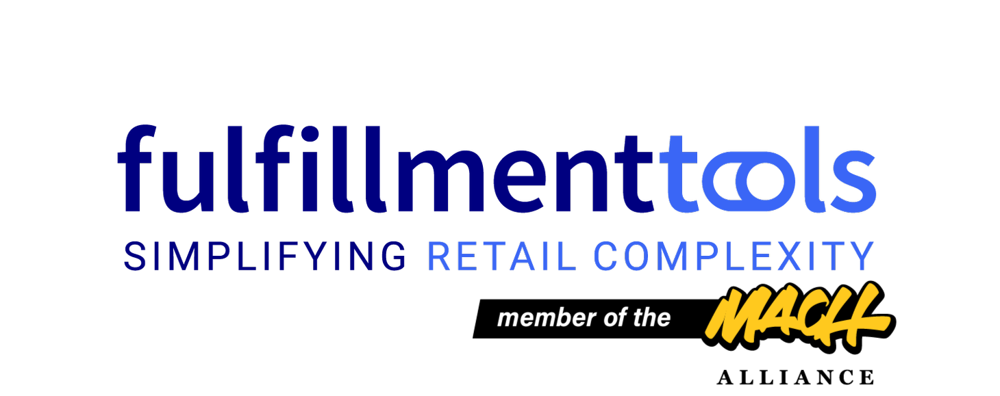

<p align="center">
  <a href="https://fulfillmenttools.com/">
    
  </a></br>
  <b>Fulfillmenttools TypeScript SDK</b>
</p>


[](./LICENSE)
[](./CODE_OF_CONDUCT.md)
[](./CONTRIBUTING.md)

# 🤖 Introduction

This repository contains the source code of the Fulfillmenttools TypeScript SDK.

## 👨‍💻 Development

### 👉 Requirements

- [Node.js](https://nodejs.org/en/) 18 with [NVM](https://github.com/nvm-sh/nvm) and npm

### 🛫 Setup

```bash
$ nvm use
```

### 🤸 Building

```bash
$ npm install
$ npm run build
```

### 🕵️ Running unit tests

When running unit tests the `.env.local` file will be used with dummy settings.

```bash
$ npm run test
```

### 🕵️‍♀️ Linting

```bash
$ npm run lint
```

## 📖 Documentation

The official Fulfillmenttools API documentation can be found [here](https://docs.fulfillmenttools.com/api-docs/) and we also publish our [OpenAPI specification](https://fulfillmenttools.github.io/api-reference-ui/).

## 📜 License

All code in this repository is licensed under the [MIT license](https://github.com/nwilhelmFFT/ps-fft-client/blob/master/LICENSE).

## 🙌 Contributing

We'd love to have your helping hand on this ecosystem! Please see [CONTRIBUTING.md](./CONTRIBUTING.md) for more information on our guidelines.

## :blue_heart: Thanks

Thanks for all your contributions and efforts towards improving the Fulfillmenttools TypeScript SDK. We thank you for being part of our :sparkles: community :sparkles:!
